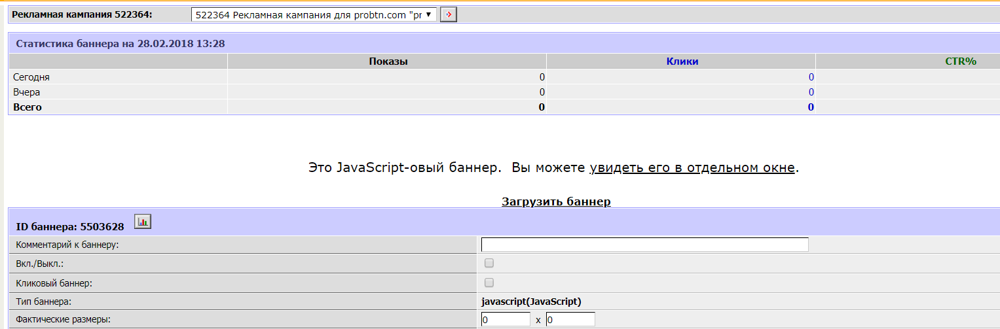

.. probtn documentation master file, created by
   sphinx-quickstart on Mon Nov  2 12:32:08 2015.
   You can adapt this file completely to your liking, but it should at least
   contain the root `toctree` directive.

.. _adriver:

Интеграция с AdRiver
==================================

Интеграция с AdRiver (баннер javascript/JavaScript)
----------------------------------

Для  такого рода интеграции, необходимо произвести следующие действия:

Step0
^^^^^^^^^^^^^^^^^^^^^^^^^^^^^^^^^
Создать кампанию  (или апп с необходимым доменом, будь то реальный домен или домен-идентификатор  аппа)

.. image:: images/adriver/adriver1_step0.png

Step1
^^^^^^^^^^^^^^^^^^^^^^^^^^^^^^^^^
Создать ``special -> javascript -> JavaScript`` баннер

Step2
^^^^^^^^^^^^^^^^^^^^^^^^^^^^^^^^^
Сохранить код баннера ``https://cdn.probtn.com/custom_include/script.js``, затем загрузить его (нажав на ссылку "Загрузить баннер")

Интеграция с AdRiver с модифицированным кодом
----------------------------------
Для  такого рода интеграции, необходимо произвести следующие действия:

Step0
^^^^^^^^^^^^^^^^^^^^^^^^^^^^^^^^^
Создать кампанию  (или апп с необходимым доменом, будь то реальный домен или домен-идентификатор  аппа)

.. image:: images/adriver/adriver1_step0.png

Step1
^^^^^^^^^^^^^^^^^^^^^^^^^^^^^^^^^
Создайте  страницу, доступную по адресу с тем же доменом, где вы хотите показывать  кнопку.
Добавьте  на страницу showinparent_concat.js ( Общее описание работы кнопки )
````
Например:

.. code-block:: html

	<!DOCTYPE html>
	<html>
	<head lang="en">
			<meta charset="utf-8">
			<meta name="viewport" content="width=device-width, initial-scale=1">
			<title>probtn (hackpad)</title>
	</head>
	<body>
			
	</body>
	</html>

Step2
^^^^^^^^^^^^^^^^^^^^^^^^^^^^^^^^^
Создать AjaxJS (Generic AjaxJS) баннер

.. image:: images/adriver/adriver2_step1.png

Step3
^^^^^^^^^^^^^^^^^^^^^^^^^^^^^^^^^
Загрузить код баннера (нажав на ссылку "Загрузить баннер")

.. image:: images/adriver/adriver2_step3.png

Пример кода для generic ajax баннера https://www.dropbox.com/s/vo4deq8g9e9yynp/generic_ajaxjs.zip?dl=0

.. image:: images/adriver/adriver2_step3_1.png

Step 4
^^^^^^^^^^^^^^^^^^^^^^^^^^^^^^^^^
В нем необходимо изменить в index.html путь до showinparent.html (создан на шаге 1)

``<iframe style="border: 0px; width: 0px; height: 0px; display: none;" src="http://example.com/showinparent.html"></iframe>``

или

``<iframe style="border: 0px; width: 0px; height: 0px; display: none;" src="http://example.com/showinparent.html?domain=nessasary_example_app_domain.test"></iframe>``

Url ``//example.com/showinparent.html?domain=nessasary_example_app_domain.test`` добавлен для примера, необходимо использовать свой путь (до страницы созданной на шаге 1)

GET параметр domain опционален, и необходим в случае, если нужно жестко задать домен, для которого будут браться настройки из admin.probtn.com

 Также значение GET параметра domain (для примера указано) ``nessasary_example_app_domain.test`` нужно заменить на необходимый домен (идентификатор), используемый в нужном аппе в admin.probtn.com

Указание кампании (опционально)
^^^^^^^^^^^^^^^^^^^^^^^^^^^^^^^^^

Также возможно указать идентификатор кампании, по которому кнопка будет показывать креативы только указанной кампании для аппа.

Для этого необходимо создать объявление с кодом

``<iframe style="border: 0px; width: 0px; height: 0px; display: none;"  src="//example.com/example_iframe_page.html?domain=nessasary_example_app_domain.test&SelectAdSet=565e021f99c27511100000d0"></iframe>``

Url //example.com/example_iframe_page.html добавлен для примера, необходимо использовать свой путь (до страницы созданной на шаге 1)
Значение GET параметра domain (для примера указано) nessasary_example_app_domain.test нужно заменить на необходимый домен (идентификатор), используемый в нужном аппе в admin.probtn.com

Значение GET параметра SelectAdSet (для примера указано) ``565e021f99c27511100000d0`` нужно заменить на идентификатор кампании (не нужно указывать идентификатор placement или creative)
Сам идентификатор можно найти в адресной строке, открыв страницу кампании.

.. image:: images/adriver/adriver2_step3_2.png
